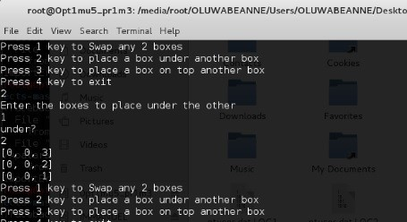
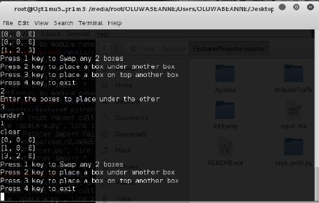

# Robot Arm Dialogue
Robot Arm Dialogue System capable of creating unique boxes and adding them its world with commands as well as Dialogue and Action System to interact with the Robot in its world

## Test of System

**Figure 1**

**Figure 2**

## Language of Robot Plan
The robot plans can be represented using First Order Predicate Calculus (FOPC). The FOPC is a system of logic in which it is possible to formally express much of the statements of everyday language. The FOPC state-space is closed. This implies that when its logics and relations are applied on its objects and terms, they (i.e. the objects and terms) retain their features. The space may change state but its original feature remains unchanged. This way, the state space cannot be extended or contrasted, but can be made to transit from one configuration, or form, to another.
In the FOPC system, there is no anticipation of the possibility of latter revision of the state space. A term in the system can assume only one of the set of two values: True (Accepted) or False (Rejected). Every situation is wholly false or wholly true: there is nothing in between. In the FOPC, an expression can either be true or false not partly true and partly false.
This formal system can be used to model the state space in a primitive dialogue for a robot arm domain. The robot world state space is specified by a set of propositions and connectives (or operators). The proposition and connectives expresses truth relations among objects in a configuration of the robot world. There are also robot action propositions which express the trustfulness of the robot arm actions. The objects in the robot world, i.e. the boxes, can be abstractly manipulated using the robot action propositions. If an action can be (or had been) carried out successfully then, the proposition will return True. It will return False otherwise.
predicate calculus = proposition logic + universal quantifiers

## Technological Interpretation and Application of Results
The ROBOT ARM is designed using python which gives the design view of the real life system based on an Artificial Intelligence system.
The knowledge gotten from the ROBOT ARM is applicable in real life situations e.g. Mass production lines and Sea Ports
o	The mass production line includes the moving of parts of a production, parts of cars. The arm can be used to fix the parts together, and to move them off the line.
o	In sea port to move containers around and place them in required positions.

## Summary and Conclusion
This experiment is based on an analogy of a ROBOT arm, and the simulation and manipulation of boxes A, B, C represented by 1, 2, 3, respectively. We have been able to determine the ROBOT ARM movement and also implement the game with a programming language (PYTHON)

